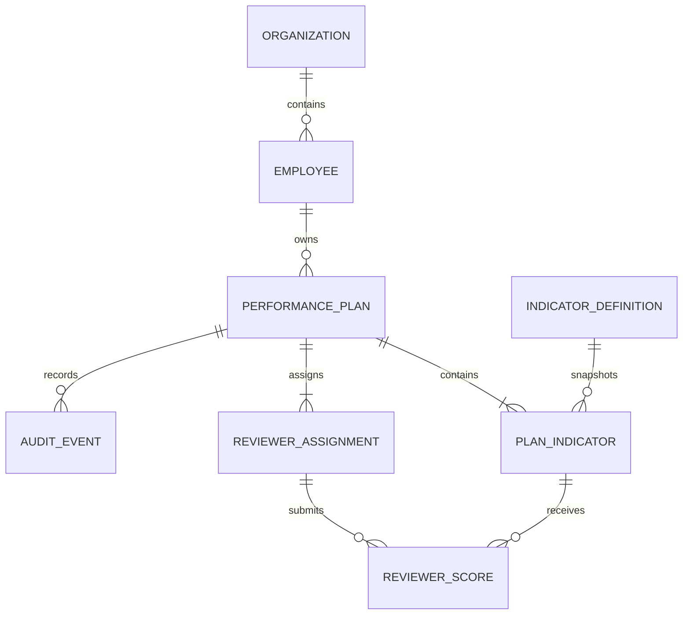
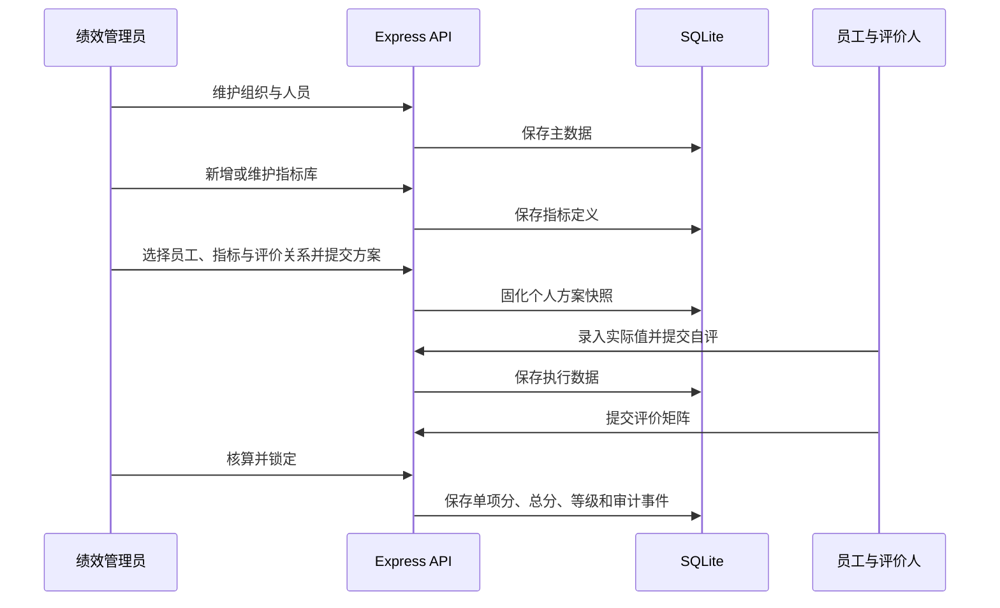

# 绩效管理工程案例 PRD

## 1. 应用基本信息

- 应用类型：企业绩效管理系统，多页面业务应用。
- 业务目标：验证在宜搭多页面前端、Express API 与 SQLite 数据库组合下，AI 能否完成主数据维护、指标库管理、绩效方案配置、数据填报、自评、多方评价、核算与审计的端到端开发。
- 核心用户：绩效管理员、组织维护人员、员工、数据填报人、评价人。
- 核心对象：组织、人员、指标库、考核周期、个人绩效方案、方案指标、评价关系、实际数据、自评、评价分和审计事件。
- 数据边界：业务数据全部写入 localhost SQLite；使用合成人名和组织，不写入宜搭表单、流程或业务数据。
- 宜搭边界：复用现有测试应用，仅创建所需 display 自定义页面；保留宜搭平台导航。
- 权限口径：实验版以页面职责和后端状态校验隔离操作；不模拟宜搭审批权限。
- 主题摘要：克制紫蓝、圆润高密、主从管理台；完整规则见 [design.md](design.md)。

## 2. 资源上下文

- 私有应用配置来自被 Git 忽略的 `config/targets.local.json`；文档和源码不保存真实 `appType`、组织或页面 ID。
- 本地 API：逻辑键 `performanceApi`，默认 `http://127.0.0.1:4328/api/performance`。
- 本地数据库：`.local/performance/performance.sqlite`。
- display 页面：
  1. `performance.overview`：绩效运行总览。
  2. `performance.people`：人员与组织。
  3. `performance.indicators`：绩效指标库。
  4. `performance.configuration`：个人绩效配置。
  5. `performance.dataEntry`：绩效数据与自评。
  6. `performance.assessment`：绩效评价与结算。
- 不创建普通表单、流程表单、流程实例、报表、连接器或宜搭业务记录。

## 3. 角色与核心任务

| 角色         | 核心任务                                   | 关键约束                           |
| ------------ | ------------------------------------------ | ---------------------------------- |
| 绩效管理员   | 维护周期、人员、指标库，生成并提交个人方案 | 方案指标和评价权重分别精确等于 100 |
| 组织维护人员 | 新增、编辑、停用组织与人员                 | 被方案引用的主数据不物理删除       |
| 数据填报人   | 按方案录入实际完成值                       | 必须完整填写后才能进入自评         |
| 员工         | 查看个人方案并逐项自评                     | 自评仅供参考，不直接计入总分       |
| 评价人       | 对每项指标评分                             | 单项评分范围为 `0..指标权重`       |
| 系统         | 固化快照、核算、评级、锁定并审计           | 结算后禁止修改执行事实             |

## 4. 领域与数据模型

### SQLite 表

1. `organizations`：组织编码、名称、负责人、状态。
2. `employees`：工号、姓名、岗位、所属组织、状态。
3. `indicator_definitions`：指标编码、名称、分类、计分方式、单位、默认目标、默认权重、状态。
4. `scenarios`：当前周期的个人绩效方案头，关联员工并保存阶段、配置状态、最终分和等级。
5. `indicators`：从指标库复制形成的方案指标快照，保存目标、权重、实际值、自评和最终分。
6. `reviewers`：方案评价关系与评价权重。
7. `reviewer_scores`：评价人 × 方案指标评分矩阵。
8. `audit_events`：所有业务提交、维护和结算事件。

### 领域不变量

1. 组织编码、人员工号和指标编码唯一。
2. 停用的人员和指标不能用于新方案，但历史快照保持可读。
3. 方案提交时指标权重合计必须精确等于 100。
4. 评价人权重合计必须精确等于 100，不静默归一化。
5. 系统指标得分为 `ROUND_HALF_UP(MAX(0, MIN(actual / target × weight, weight)), 2)`。
6. 人工评分范围为 `0..指标权重`；多评价人得分按评价权重加权。
7. 自评只作参考；结算后方案、数据和评分全部只读。
8. 删除主数据采用停用或引用检查，不级联破坏历史方案。

## 5. 动态模型

### 方案状态机

`CONFIGURATION -> DATA_ENTRY -> SELF_REVIEW -> REVIEW -> CALCULATION -> LOCKED`

### 主成功路径

## 6. 页面与功能设计

### 6.1 绩效运行总览

- scene：`workbench`。
- 目标：查看主数据规模、当前方案阶段、待处理动作、最近审计和结果。
- 区块：标题上下文、周期筛选、紧凑状态摘要、当前方案、阶段轨道、待处理动作、最近审计、数据健康提示、错误/空态行动。
- 主操作：按当前状态进入相应宜搭页面；跨页只导航最外层应用壳。
- pageSpecHandoff：
  - pageStructure：`workbench`
  - designFile：`prd/performance-case/design.md`
  - designRefs：`themeProfile`、`visualScaffold.workbench`、`states`
  - dataBinding：`connector`，localhost API

### 6.2 人员与组织

- scene：`list`，独立 display 页面。
- 目标：维护组织和人员主数据，而不是在绩效方案里临时输入姓名。
- 区块：组织筛选、人员搜索、状态筛选、组织列表、人员表格、新增人员、编辑人员、启停操作、引用错误反馈、薄空态。
- 主操作：新增/编辑组织和人员；所有控件受控，写操作由用户确认触发。
- pageSpecHandoff：`business-list`；引用 `design.md` 的 `visualScaffold.list`；数据源为 localhost API。

### 6.3 绩效指标库

- scene：`list`，独立 display 页面。
- 目标：维护可复用指标定义，包括编码、名称、分类、计分方式、单位、默认目标、默认权重和状态。
- 区块：搜索、分类筛选、状态筛选、指标表格、新增指标、编辑指标、启停、计分口径说明、错误/空态。
- 主操作：新增或编辑指标；停用后不能进入新方案。
- pageSpecHandoff：`business-list`；引用 `visualScaffold.list`；数据源为 localhost API。

### 6.4 个人绩效配置

- scene：`split-pane`。
- 目标：从在职人员和启用指标库中选择真实主数据，形成个人周期方案。
- 区块：周期上下文、员工选择、组织岗位只读上下文、指标选择、权重与目标编辑、评价关系、双 100 校验、提交快照、状态反馈。
- 主操作：保存并提交配置；提交后进入数据填报。
- pageSpecHandoff：`split-pane-detail`；引用 `visualScaffold.splitPane`；数据源为 localhost API。

### 6.5 绩效数据与自评

- scene：`list`。
- 目标：按个人方案录入实际值，再逐项提交员工自评。
- 区块：方案摘要、状态说明、指标表格、实际值输入、系统原始分、自评分输入、字段校验、提交动作、只读历史。
- 主操作：提交实际数据或提交员工自评。
- pageSpecHandoff：`business-list`；引用 `visualScaffold.list`；数据源为 localhost API。

### 6.6 绩效评价与结算

- scene：`split-pane`。
- 目标：填写评价矩阵、核算总分与等级并锁定快照。
- 区块：方案摘要、评价人权重、评价矩阵、范围校验、系统指标说明、核算动作、结果摘要、审计轨迹、锁定提示。
- 主操作：提交评价矩阵；核算并锁定结果。
- pageSpecHandoff：`split-pane-detail`；引用 `visualScaffold.splitPane`；数据源为 localhost API。

## 7. API 契约

- `GET /health`、`GET /workspace`：健康和聚合工作区。
- `GET/POST/PUT /organizations`：组织查询、新增、编辑/启停。
- `GET/POST/PUT /employees`：人员查询、新增、编辑/启停。
- `GET/POST/PUT /indicators`：指标库查询、新增、编辑/启停。
- `POST /scenario/reset`：只重置合成绩效方案，不删除维护后的主数据。
- `POST /actions/submit-configuration`：使用主数据 ID 创建并提交方案快照。
- `POST /actions/submit-actuals`、`submit-self-review`、`submit-reviewers`、`calculate-and-settle`：推进执行状态。
- 响应统一为 `{ success, data|error, meta: { requestId } }`；写操作使用事务、稳定错误码和审计记录。

## 8. 资源与顺序

### 资源创建顺序

设计文档 -> SQLite 主数据表与迁移 -> CRUD/方案 API -> 六个 Canvas 页面 -> 自动化测试 -> 创建缺失 display 页面 -> 发布 -> 导航排序 -> 远程回归。

### 页面实现交付顺序

运行总览 -> 人员与组织 -> 指标库 -> 个人配置 -> 数据与自评 -> 评价与结算。

### 导航顺序

保留宜搭平台导航，六页连续排列：绩效运行总览、人员与组织、绩效指标库、个人绩效配置、绩效数据与自评、绩效评价与结算。页面内容区不再自绘同级模块菜单。

## 9. 验收标准

1. 能新增、编辑和停用组织、人员及指标；刷新后数据仍在 SQLite。
2. 个人配置只能选择在职人员和启用指标，双权重校验不通过时后端拒绝提交。
3. 实际值、自评和评价矩阵必须由用户录入，后端不生成预设业务输入。
4. 完整链路可到 `LOCKED`，得分可由规则精确复算；锁定后拒绝写入。
5. 六页均为独立宜搭 display 页面，跨页不产生应用菜单嵌套。
6. 单元测试、本地 Playwright、Canvas 构建、契约检查、发布读回和真实宜搭回归全部通过。
7. 不创建或写入任何宜搭普通表单、流程或业务记录；仓库不包含真实应用、组织、人员或页面 ID。
