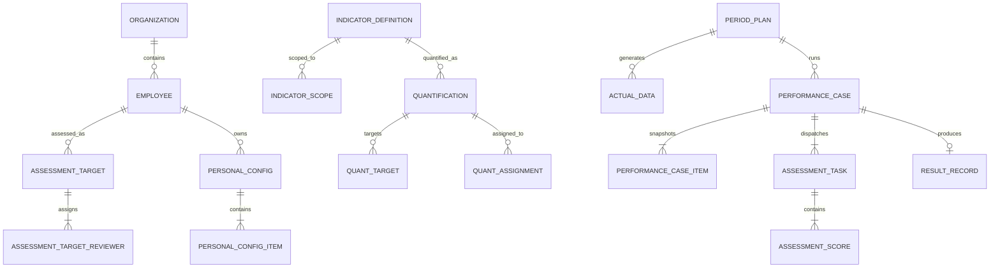
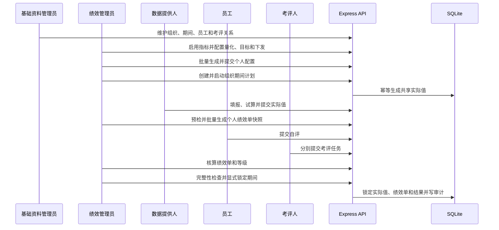

# 真实绩效管理系统 V2 PRD

## 1. 应用基本信息

| 项目     | 内容                                                                                                           |
| -------- | -------------------------------------------------------------------------------------------------------------- |
| 应用名称 | 绩效运营与考评系统                                                                                             |
| 应用类型 | 企业管理 + 绩效运营 + 经营分析，多角色、多页面业务系统                                                         |
| 实验目标 | 验证明确业务模型、页面地图、契约和验收门禁后，AI 能否自主完成真实规模的宜搭 Canvas + Express + SQLite 全栈系统 |
| 业务目标 | 支撑基础资料、指标配置、周期运营、个人配置、数据填报、自评考评、核算锁定和结果分析的完整闭环                   |
| 核心用户 | 绩效管理员、HR/基础资料管理员、组织负责人、数据提供人、员工、考评人、管理层                                    |
| 使用场景 | PC 管理和批量操作为主，移动端处理个人填报、个人自评和考评任务                                                  |
| 核心对象 | 组织、期间、员工、考评关系、指标、量化方案、目标、下发关系、个人配置、实际值、绩效单、评价任务、结果和审计事件 |
| 主题色   | 沿用当前测试应用紫蓝主题；完整视觉契约见 `prd/performance-system-v2/design.md`                                 |
| 权限口径 | 后端角色权限是权威；前端隐藏无权操作只是体验优化，不代替 API 鉴权                                              |

### 1.1 实验边界

- 复用现有宜搭测试应用，只创建独立 display 自定义页面，保留宜搭平台导航。
- 前端使用 React、TypeScript、Ant Design；后端使用 Express、TypeScript；数据库使用 SQLite。
- 本轮不创建宜搭普通表单、不发起宜搭流程、不写入宜搭业务记录，流程能力在 SQLite 中建模并由本地 API 驱动。
- 所有人员、组织、指标和业务记录都是合成数据；仓库不保存真实应用 ID、组织 ID、人员 ID或凭证。
- 当前 `labs/performance-fullstack` 保留为技术纵切片，不在原目录继续堆功能；V2 使用新目录 `labs/performance-system/`。

### 1.2 不再接受的 Demo 形态

- 固定一个 `scenarioId`、一个员工或一个期间贯穿所有页面。
- 用一个 `/workspace` 聚合接口代替资源查询、分页和权限边界。
- 页面打开后直接展示预设完成链路，没有列表选择、批量操作和异常任务。
- 只有一条 happy path，缺少退回、重试、锁定阻断、并发和权限测试。
- 用重置按钮代替正常的业务新建、归档和历史查询。

## 2. 角色、任务与权限

| 角色           | 高频任务                                                         | 可见范围               | 关键权限                               |
| -------------- | ---------------------------------------------------------------- | ---------------------- | -------------------------------------- |
| 绩效管理员     | 建期间计划、配置时间窗、批量生成个人配置和绩效单、跟踪进度、锁定 | 全组织或授权组织       | 周期运营、批量动作、退回、受控解锁     |
| 基础资料管理员 | 维护组织、期间、排名序列、等级规则、361 规则、员工和考评关系     | 全部基础资料           | 新增、编辑、启停、导入、数据质量检查   |
| 指标管理员     | 维护指标库、适用范围、量化口径、目标、下发关系                   | 授权组织和年度         | 指标启停、量化、批量下发、导入         |
| 组织负责人     | 查看本组织覆盖率和进度，维护或确认本组织个人配置                 | 本组织及下级           | 配置确认、异常处理、结果分布查看       |
| 数据提供人     | 填报共享实际值、试算、提交、处理退回                             | 分配给自己的指标和期间 | 草稿、提交、查看引用影响               |
| 员工           | 查看我的指标、提交自评、查看已发布结果                           | 仅本人                 | 自评和个人结果查看                     |
| 考评人         | 处理分配给自己的评价任务                                         | 仅本人待评员工         | 评分、暂存、提交，不查看其他考评人评分 |
| 管理层         | 查看覆盖率、完成率、结果分布和异常                               | 授权组织聚合数据       | 只读分析和下钻                         |

开发环境提供“合成角色切换器”，只改变本地测试身份；生产式代码仍由后端返回当前用户和权限集合。

## 3. 业务能力地图

```text
基础资料
  组织 / 期间 / 排名序列 / 等级规则 / 361 规则 / 员工考核对象
        ↓
指标体系
  指标库 / 适用组织 / 量化口径 / 期间目标 / 数据提供人 / 下发关系
        ↓
个人配置
  批量生成 / 组织下发指标 / 个人补充指标 / 权重校验 / 提交与退回
        ↓
期间运行
  计划与时间窗 / 实际值生成 / 数据填报 / 绩效单生成 / 自评 / 多人考评
        ↓
核算结果
  项目得分 / 总分 / 等级 / 361 检查 / 完整性检查 / 锁定 / 受控解锁
        ↓
运营治理
  待办 / 异常 / 导入批次 / 任务运行 / 审计 / 结果分析
```

## 4. 数据模型

### 4.1 基础资料域

| 表                            | 粒度                          | 关键字段与约束                                       |
| ----------------------------- | ----------------------------- | ---------------------------------------------------- |
| `organizations`               | 一个组织                      | code 唯一、parent_id、自上而下层级、ACTIVE/INACTIVE  |
| `periods`                     | 一个绩效期间                  | year、mode `0/1/2/3`、period_no、起止日期、code 唯一 |
| `ranking_sequences`           | 一个组织的一条排名序列        | organization_id、code、name、status                  |
| `grade_rules`                 | 一个组织的一档等级区间        | lower、upper、grade；同组织有效区间不得重叠          |
| `distribution_rules`          | 一个组织和团队规模的 361 规则 | A-G 允许人数合计必须等于 team_size                   |
| `employees`                   | 一名员工                      | employee_no 唯一、组织、岗位、ACTIVE/INACTIVE        |
| `assessment_targets`          | 年度 + 周期 + 组织 + 员工     | 唯一考核对象、排名序列、状态                         |
| `assessment_target_reviewers` | 一个考核对象的一名考评人      | reviewer_employee_id、weight、group；权重合计 100    |

### 4.2 指标配置域

| 表                      | 粒度               | 关键字段与约束                                                                                         |
| ----------------------- | ------------------ | ------------------------------------------------------------------------------------------------------ |
| `indicator_definitions` | 一条指标定义       | code、name、definition、scoring_standard、calc_method、assess_type、year、mode、DRAFT/ENABLED/DISABLED |
| `indicator_scopes`      | 指标与适用组织关系 | indicator_id + organization_id 唯一                                                                    |
| `quantifications`       | 年度 + 组织 + 指标 | 数据提供人、执行公式、周期编码、ENABLED/DISABLED                                                       |
| `quant_targets`         | 量化 + 期间        | 数值或文本目标二选一，组合唯一                                                                         |
| `quant_assignments`     | 量化下发给一名员工 | employee_id、weight、有效期、状态                                                                      |

### 4.3 个人配置域

| 表                      | 粒度                      | 关键字段与约束                                        |
| ----------------------- | ------------------------- | ----------------------------------------------------- |
| `personal_configs`      | 年度 + 组织 + 周期 + 员工 | DRAFT/SUBMITTED/INVALID、总权重、version              |
| `personal_config_items` | 个人配置中的一个指标      | quantification_id、source_type、weight、sort_no、状态 |

`ORG_ASSIGNMENT` 指标不可由员工删除或改权重；`PERSONAL_ADDED` 指标可由有权限的管理员调整。提交时有效权重必须精确等于 100。

### 4.4 期间运行域

| 表                       | 粒度                      | 关键字段与约束                                                                           |
| ------------------------ | ------------------------- | ---------------------------------------------------------------------------------------- |
| `period_plans`           | 组织 + 期间               | 配置、填报、自评、考评、锁定时间窗；DRAFT/NOT_STARTED/RUNNING/WAIT_LOCK/COMPLETED/CLOSED |
| `actual_data`            | 量化 + 期间共享一条实际值 | DRAFT/SUBMITTED/RETURNED/LOCKED/INVALID、目标、实际值、公式、计算分                      |
| `performance_cases`      | 计划 + 员工唯一绩效业务   | PREPARING/READY/SELF_REVIEW/REVIEWING/CALCULATING/COMPLETED/LOCKED/VOID                  |
| `performance_case_items` | 绩效单中的指标快照        | 指标、目标、实际、权重、规则、自评、最终项目分                                           |
| `assessment_tasks`       | 绩效单 + 一名考评人       | PENDING/DRAFT/SUBMITTED/CANCELLED、考评权重、截止时间                                    |
| `assessment_scores`      | 评价任务 + 一个绩效项目   | score、comment；单项范围 `0..项目权重`                                                   |
| `result_records`         | 一份已完成绩效结果        | total_score、grade、distribution_status、published_at                                    |

### 4.5 治理与可观测域

| 表              | 粒度                 | 关键字段与约束                                                       |
| --------------- | -------------------- | -------------------------------------------------------------------- |
| `import_jobs`   | 一次文件导入         | UPLOADED/VALIDATED/COMMITTED/PARTIAL_FAILED、行数和错误报告          |
| `job_runs`      | 一次批量/后台任务    | task_type、PENDING/RUNNING/SUCCESS/PARTIAL_SUCCESS/FAILED、进度      |
| `change_events` | 一次配置变更影响事件 | 影响对象数量、确认人、原因、前后摘要                                 |
| `audit_events`  | 一次业务动作         | actor、role、resource、action、request_id、result、before/after 摘要 |

### 4.6 核心关系



## 5. 状态机与领域规则

### 5.1 状态机

```text
指标：DRAFT → ENABLED → DISABLED；DRAFT 可删除，已引用只能停用
个人配置：DRAFT ↔ SUBMITTED → INVALID
期间计划：DRAFT → NOT_STARTED → RUNNING → WAIT_LOCK → COMPLETED；任意非完成态可受控 CLOSED
实际值：DRAFT → SUBMITTED → LOCKED；SUBMITTED → RETURNED → SUBMITTED
绩效单：PREPARING → READY → SELF_REVIEW → REVIEWING → CALCULATING → COMPLETED → LOCKED
评价任务：PENDING → DRAFT → SUBMITTED；未开始任务可 CANCELLED
导入批次：UPLOADED → VALIDATED → COMMITTED / PARTIAL_FAILED
```

### 5.2 计算和完整性规则

1. 周期编码统一使用 `0=年度、1=半年度、2=季度、3=月度`，数据库和 API 只传编码。
2. 指标权重、评价人权重均精确校验 100，不静默归一化。
3. 系统指标项目分：`ROUND_HALF_UP(MAX(0, MIN(actual / target × weight, weight)), 2)`。
4. 人工指标由多名考评人按考评权重加权；员工自评只展示，不进入最终分。
5. 最终总分不静默截断；超出规则范围必须作为核算异常返回。
6. 共享实际值按“量化 + 期间”唯一，同一实际值可被多名员工绩效单引用。
7. 创建绩效单时冻结指标、目标、权重、实际值、计分规则和考评关系；后续配置修改不静默覆盖快照。
8. 锁定必须由绩效管理员显式执行；存在未提交实际值、未完成绩效单、运行中任务或核算异常时拒绝锁定。
9. 解锁需要原因、权限和审计事件，并恢复到符合截止时间的运行状态。
10. 所有提交、批量生成、核算、锁定和解锁使用事务与乐观锁；重复请求使用幂等键。

## 6. 页面地图与功能设计

平台导航保留，页面内不自绘同级应用菜单。每个业务页面对应一个宜搭 display 页面。

### 6.1 绩效运营工作台

- 页面定位：应用第一入口，按当前角色展示真正需要处理的任务。
- 页面关系：下钻到期间运行、数据填报、个人配置、评价任务、结果分析。
- contentBlocks：角色与期间上下文、数据新鲜度、紧凑状态摘要、今日待办、逾期与阻断、期间进度、最近批次、最近操作、结果快照、右侧行动建议、异常提示、空态行动。
- 主操作：处理最高优先级待办；新建期间计划仅对管理员显示。
- pageSpecHandoff：
  - pageStructure：`workbench`
  - scene：`workbench`
  - themeSummary：紫蓝主题、行动队列、高密专业、`themeScope=page`
  - designFile：`prd/performance-system-v2/design.md`
  - designRefs：`themeProfile`、`sceneRecipes.workbench`、`components.actionRail`、`states`
  - dataBinding：REST API `/v2/workbench`
  - primaryAction：根据最高优先级任务跳转到对应独立页面

### 6.2 绩效基础数据中心

- 页面定位：组织、期间、序列、等级、361、员工考核对象的统一维护入口。
- contentBlocks：资料类型切换、年度/组织筛选、数据质量摘要、主列表、层级浏览、详情预览、新增编辑、启停确认、考评关系编辑、冲突检查、导入入口、同步/更新时间、薄空态。
- 主操作：维护当前选中的一种基础资料；考评对象详情可编辑 1-5 名考评人和权重。
- pageSpecHandoff：`split-pane-detail` / `list`；引用 `sceneRecipes.masterData`；数据绑定 `/v2/base/*`。

### 6.3 指标库

- 页面定位：维护企业指标定义和适用组织范围。
- contentBlocks：年度上下文、关键字/类型/状态筛选、指标列表、定义详情、评分标准、适用组织、草稿编辑、启用校验、停用影响预览、Excel 导入、年度复制、错误明细、审计时间线。
- 主操作：保存草稿、启用指标、确认停用影响。
- pageSpecHandoff：`split-pane-detail` / `list`；引用 `sceneRecipes.managementList`；数据绑定 `/v2/indicators`。

### 6.4 指标量化与下发

- 页面定位：把指标转成可执行的组织年度量化方案，并配置目标、数据提供人和员工下发。
- contentBlocks：年度/组织/指标筛选、量化列表、执行公式、数据提供人、期间目标矩阵、下发人员列表、批量选择、权重编辑、适用范围校验、影响范围、保存提交、异常反馈。
- 主操作：保存量化方案、批量下发员工、维护期间目标。
- pageSpecHandoff：`split-pane-detail` / `list`；引用 `sceneRecipes.configurationWorkbench`；数据绑定 `/v2/quantifications`。

### 6.5 个人指标配置管理

- 页面定位：面向管理员和组织负责人批量生成并维护多名员工的年度指标配置。
- contentBlocks：年度/周期/组织筛选、覆盖率摘要、人员配置列表、配置状态筛选、批量生成、批量提交、左侧员工队列、右侧指标明细、组织下发锁定项、个人补充项、权重校验、退回原因、变更影响提示、版本冲突反馈。
- 主操作：批量生成草稿、编辑个人配置、提交或退回。
- pageSpecHandoff：`split-pane-detail` / `list`；引用 `sceneRecipes.configurationWorkbench`；数据绑定 `/v2/personal-configs`。

### 6.6 我的年度指标

- 页面定位：员工只读查看年度配置、指标来源、目标、权重和提交状态。
- contentBlocks：本人身份、年度/周期切换、配置状态、总权重、组织下发指标、个人补充指标、指标详情、目标说明、评分标准、变更提示、历史期间入口、无配置行动。
- 主操作：查看指标详情；无编辑权限。
- pageSpecHandoff：`detail-profile` / `detail`；引用 `sceneRecipes.personalDetail`；数据绑定 `/v2/me/configs`。

### 6.7 我的数据填报

- 页面定位：数据提供人处理自己负责的共享实际值任务。
- contentBlocks：本人任务摘要、期间筛选、待填/退回/已提交分段、任务列表、目标与公式、实际值输入、实时试算、引用员工数量、退回原因、暂存、提交确认、历史记录、错误反馈。
- 主操作：保存草稿、试算、提交。
- pageSpecHandoff：`split-pane-detail` / `list`；引用 `sceneRecipes.taskWorkbench`；数据绑定 `/v2/me/actual-tasks`。

### 6.8 数据填报管理

- 页面定位：管理员查看全组织填报进度、退回错误数据和处理异常。
- contentBlocks：组织/期间筛选、完成率摘要、状态分布、逾期清单、数据提供人排行、实际值列表、引用影响、批量提醒、退回动作、异常公式、导出、审计记录。
- 主操作：退回单条实际值、批量提醒未提交人员。
- pageSpecHandoff：`dashboard-overview` / `dashboard`；引用 `sceneRecipes.operationsDashboard`；数据绑定 `/v2/actuals/management`。

### 6.9 我的绩效任务

- 页面定位：员工提交自评，考评人处理评价任务；同页按当前角色展示不同任务队列。
- contentBlocks：本人角色、期间筛选、待办摘要、员工自评任务、考评任务队列、绩效单摘要、指标快照、自评分输入、考评分输入、评分范围、暂存、提交确认、截止时间、已办历史、无任务状态。
- 主操作：提交自评或考评任务；不能查看其他考评人的评分。
- pageSpecHandoff：`split-pane-detail` / `workbench`；引用 `sceneRecipes.taskWorkbench`；数据绑定 `/v2/me/performance-tasks`。

### 6.10 绩效流程管理

- 页面定位：管理员批量准备、生成、核算和处理异常绩效单。
- contentBlocks：组织/期间筛选、准备度摘要、状态分布、候选人员、阻断原因、批量生成、绩效单列表、评价完成度、核算预览、失败重试、受控作废、结果校验、任务批次、审计。
- 主操作：预检、批量生成、重试失败任务、核算完成绩效单。
- pageSpecHandoff：`business-list` / `list`；引用 `sceneRecipes.operationsConsole`；数据绑定 `/v2/performance-cases`。

### 6.11 绩效期间运行管理

- 页面定位：绩效管理员控制组织期间白名单、时间窗、完整性检查、锁定和解锁。
- contentBlocks：组织/期间选择、计划状态、五类时间窗、实际值进度、个人配置覆盖率、绩效单完成率、运行任务、完整性检查结果、阻断清单、显式锁定、受控解锁、关闭计划、事件时间线、结果发布状态。
- 主操作：启动期间、运行完整性检查、锁定、填写原因后解锁。
- pageSpecHandoff：`dashboard-overview` / `workbench`；引用 `sceneRecipes.periodOperations`；数据绑定 `/v2/period-plans`。

### 6.12 绩效结果与分析

- 页面定位：管理层查看组织绩效分布、等级结构、异常和个人结果下钻。
- contentBlocks：组织/期间筛选、结果发布时间、覆盖率、平均分与中位数、等级分布、组织对比、分数区间、361 检查、异常名单、个人结果表、详情抽屉、导出、口径说明、无权限状态。
- 主操作：下钻个人结果、导出授权范围结果。
- pageSpecHandoff：`dashboard-overview` / `dashboard`；引用 `sceneRecipes.analyticsDashboard`；数据绑定 `/v2/results`。

### 6.13 系统运行与审计

- 页面定位：查看导入批次、后台任务、失败重试、审计事件和系统健康。
- contentBlocks：服务健康、数据库状态、任务配置、运行批次、导入批次、失败列表、重试动作、请求关联、资源审计、操作人筛选、事件详情、配置变更影响、数据导出、危险动作说明。
- 主操作：重试允许重试的失败任务；查看审计详情。
- pageSpecHandoff：`business-list` / `list`；引用 `sceneRecipes.operationsConsole`；数据绑定 `/v2/system`。

## 7. API 契约

### 7.1 通用约定

- 基础路径 `/api/performance/v2`。
- 列表接口统一支持 `page`、`pageSize`、`sort`、结构化筛选和总数。
- 响应为 `{ success, data, meta: { requestId, page?, pageSize?, total? } }` 或稳定错误对象。
- 写操作接受 `Idempotency-Key`；更新接受 `version`，冲突返回 `VERSION_CONFLICT`。
- 每个 API 根据当前合成身份校验角色和数据范围；拒绝返回 `FORBIDDEN`，不依赖前端隐藏按钮。

### 7.2 API 域

| API 域       | 代表接口                                                                                                               |
| ------------ | ---------------------------------------------------------------------------------------------------------------------- |
| 身份与工作台 | `GET /session`、`GET /workbench`、开发态 `POST /dev/session`                                                           |
| 基础资料     | `/organizations`、`/periods`、`/sequences`、`/grade-rules`、`/distribution-rules`、`/employees`、`/assessment-targets` |
| 指标库       | `/indicators`、`/:id/scopes`、`/:id/enable`、`/:id/disable`、`/imports`、`/copy-year`                                  |
| 量化与下发   | `/quantifications`、`/:id/targets`、`/:id/assignments`、`/bulk-assign`                                                 |
| 个人配置     | `/personal-configs`、`/bulk-generate`、`/:id/items`、`/:id/submit`、`/:id/return`                                      |
| 实际值       | `/actuals`、`/me/actual-tasks`、`/:id/calculate`、`/:id/submit`、`/:id/return`                                         |
| 绩效任务     | `/me/performance-tasks`、`/cases/:id/self-review`、`/assessment-tasks/:id/submit`                                      |
| 绩效单       | `/performance-cases`、`/preflight`、`/bulk-generate`、`/:id/calculate`、`/:id/void`                                    |
| 期间运行     | `/period-plans`、`/:id/start`、`/:id/completeness`、`/:id/lock`、`/:id/unlock`                                         |
| 结果分析     | `/results/summary`、`/results/distribution`、`/results/people`、`/results/export`                                      |
| 治理         | `/jobs`、`/imports`、`/audits`、`/health/details`                                                                      |

## 8. 关键动态用例

### 8.1 正常闭环



### 8.2 必须覆盖的异常路径

1. 个人配置权重不是 100，批量提交部分失败并返回逐人错误。
2. 共享实际值未提交，相关多名员工绩效单均保持 `PREPARING`。
3. 数据提供人提交错误实际值，管理员退回后重新提交，引用关系不丢失。
4. 同一考评人重复提交相同幂等键不产生重复评分；不同 payload 返回冲突。
5. 一名考评人未完成，绩效单不能核算。
6. 指标执行性修改发生在绩效单生成后，只提示影响并要求作废重建，不覆盖快照。
7. 锁定前存在未完成绩效单或运行中批次，完整性检查明确列出阻断对象。
8. 管理员解锁必须填写原因，所有解锁事件可审计。
9. 未授权角色直接调用管理 API 返回 403。
10. 两个管理员同时编辑同一配置，后提交者收到版本冲突并可刷新比较。

## 9. 资源蓝图与导航

### 9.1 资源蓝图

| 资源             | 类型                            | 创建策略                                   |
| ---------------- | ------------------------------- | ------------------------------------------ |
| 绩效运营工作台   | display-page                    | V2 主入口与运行总览                        |
| 绩效基础数据中心 | display-page                    | 组织、人员、期间与角色维护                 |
| 指标库           | display-page                    | 指标定义与生命周期管理                     |
| 指标量化与下发   | display-page                    | 期间量化、适用范围和组织下发               |
| 个人指标配置管理 | display-page                    | 个人指标组合与批量下发                     |
| 我的年度指标     | display-page                    | 员工个人指标视图                           |
| 我的数据填报     | display-page                    | 员工或数据责任人填报入口                   |
| 数据填报管理     | display-page                    | 全员填报进度和异常管理                     |
| 我的绩效任务     | display-page                    | 自评与考评任务处理                         |
| 绩效流程管理     | display-page                    | 本地绩效单状态机运行                       |
| 绩效期间运行管理 | display-page                    | 预检、批量生成与期间操作                   |
| 绩效结果与分析   | display-page                    | 等级、排名与组织结果分析                   |
| 系统运行与审计   | display-page                    | 批处理、错误重试和审计事件                 |
| REST API         | Express + TypeScript            | 新建 `/v2` 路由，旧纵切片 API 保留只作对照 |
| 数据库           | SQLite                          | 新建 V2 schema 和迁移，不复用单场景表语义  |
| 自动化测试       | Node Test + Vitest + Playwright | 单元、API、角色、跨页面、远程宜搭四层      |
| 普通/流程表单    | 不创建                          | 由实验边界明确排除                         |

### 9.2 导航顺序

| 分组     | 页面顺序                                                   |
| -------- | ---------------------------------------------------------- |
| 我的工作 | 绩效运营工作台、我的年度指标、我的数据填报、我的绩效任务   |
| 绩效配置 | 绩效基础数据中心、指标库、指标量化与下发、个人指标配置管理 |
| 期间运营 | 数据填报管理、绩效流程管理、绩效期间运行管理               |
| 结果分析 | 绩效结果与分析                                             |
| 系统治理 | 系统运行与审计                                             |

## 10. 实施和交付顺序

### 10.1 资源创建顺序

设计冻结 → 新 V2 目录和契约 → SQLite schema/migration/seed → 角色权限和基础资料 API → 指标配置 API → 期间执行 API → 页面 → 自动化测试 → 创建宜搭 display 页面 → 发布和导航。

### 10.2 页面实现交付顺序

1. 绩效基础数据中心：证明多对象 CRUD、层级、分页和权限。
2. 指标库：证明生命周期、范围、导入和影响预览。
3. 指标量化与下发：证明复杂关联配置和批量操作。
4. 个人指标配置管理：证明多人员列表、主从编辑和批量状态流转。
5. 我的年度指标与我的数据填报：证明角色化个人任务。
6. 数据填报管理：证明共享数据和管理异常。
7. 我的绩效任务与绩效流程管理：证明多用户多任务闭环。
8. 期间运行管理：证明完整性检查、锁定和解锁。
9. 结果分析：证明真实多记录聚合和下钻。
10. 运营工作台：最后接入所有真实任务和指标，不提前用占位 KPI。
11. 系统运行与审计：收敛导入、任务、错误和请求关联。

### 10.3 对旧纵切片的复用边界

| 保留复用                                      | 明确重做                     |
| --------------------------------------------- | ---------------------------- |
| Vite/React/TypeScript/Express/SQLite 工程方式 | 单场景 `scenarios` 数据模型  |
| Canvas 编译、发布、逻辑路由和远端读回         | `/workspace` 聚合接口        |
| requestId、统一错误、契约校验                 | 六页围绕同一员工的页面结构   |
| 得分计算、权重校验和锁定规则                  | 预设流程输入和重置场景体验   |
| Playwright 登录和远端验收能力                 | 仅一条 happy path 的测试设计 |

## 11. 验收矩阵

### 11.1 数据规模门禁

默认合成数据至少包含：3 个层级组织、2 个年度、8 个期间、20 名员工、5 种角色身份、12 个指标、6 个量化方案、4 条共享实际值、8 份个人配置、8 份绩效单和不少于 16 个评价任务。任何主页面不得因只有一条记录而通过验收。

### 11.2 功能验收

1. 所有管理列表具备搜索、筛选、分页、排序、状态、详情和可用的主操作。
2. 至少完成一次批量生成个人配置、批量提交、共享实际值填报、批量生成绩效单和期间锁定。
3. 员工、自评人、考评人和管理员看到不同任务及按钮；越权 API 确实拒绝。
4. 结果分析来自多员工真实运行数据，可从组织分布下钻到个人结果。
5. 刷新、重启 API 后状态仍由 SQLite 恢复。

### 11.3 自动化验收

- 领域单元测试：状态机、计算、权重、等级区间、361、快照和锁定。
- API 测试：CRUD、分页、批量部分失败、权限、幂等、乐观锁、事务回滚。
- Web 测试：受控筛选、表格操作、抽屉/弹窗、空载错权状态。
- 本地 E2E：分别以管理员、数据提供人、员工和考评人完成跨页面流程。
- 宜搭远程 E2E：13 页可打开、平台导航不嵌套、localhost API 正常、关键业务链路通过、浏览器错误为 0。

### 11.4 “不像 Demo”验收门禁

- 禁止固定业务对象 ID驱动全站。
- 工作台所有数字必须来自多记录聚合，并能下钻到对应列表。
- 至少两名员工处于不同流程状态，至少一个异常任务需要人工处理。
- 列表、详情和批量动作都有真实持久化反馈。
- 页面不存在“重置整个演示场景”按钮；测试数据通过独立 seed/reset CLI 管理。
- 每个页面的主要按钮至少有一个成功测试和一个失败/禁用测试。

## 12. 规划完成定义

- 本 PRD 与 `design.md` 共同冻结后，才进入 V2 实现。
- 实现期间业务对象、状态机、页面职责和验收门禁不得因开发方便被缩成单场景。
- 如果计划需要缩小范围，只能按完整纵向切片延后页面，不能在页面内用静态数据或固定对象代替真实能力。
